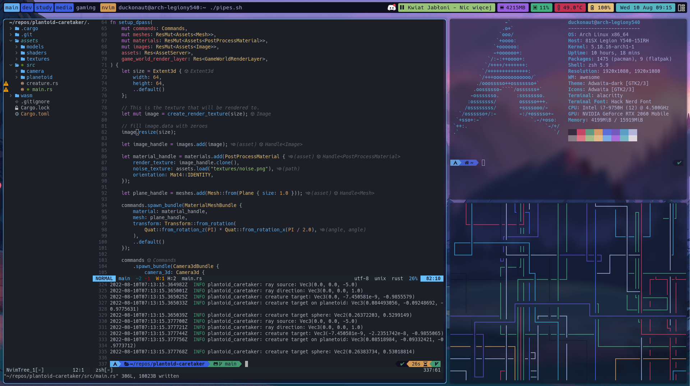

# Dotfiles
These are my assorted config files for my Linux utils. My Neovim config is in another repository as it is a largely separate project, check it out [here](https://github.com/duckonaut/skelevim).

## Screenshot

## Awesome
Based off of [awesome-copycats](https://github.com/lcpz/awesome-copycats) for the structure, it has now grown to something quite different and customized. Still uses some of those components. Also [multiplayerctl](hittps://github.com/duckonaut/multiplayerctl) to media keys.

## Picom
Pairs with the Awesome theme to achieve the blur and shadows

## Alacritty
Uses a custom colorscheme. Two files are provided, alacritty-awesome.yml differs from alacritty.yml by using transparency
